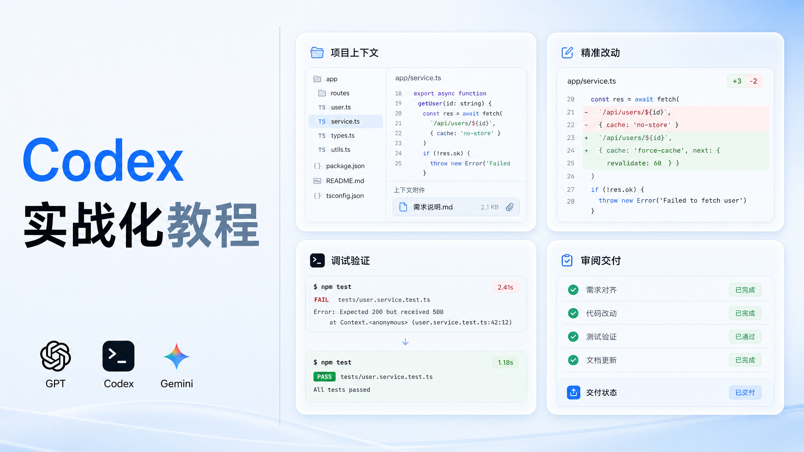
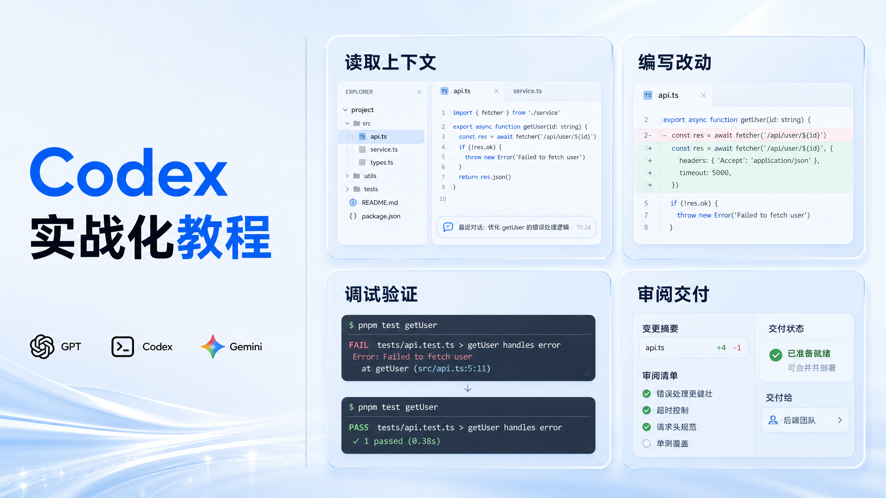
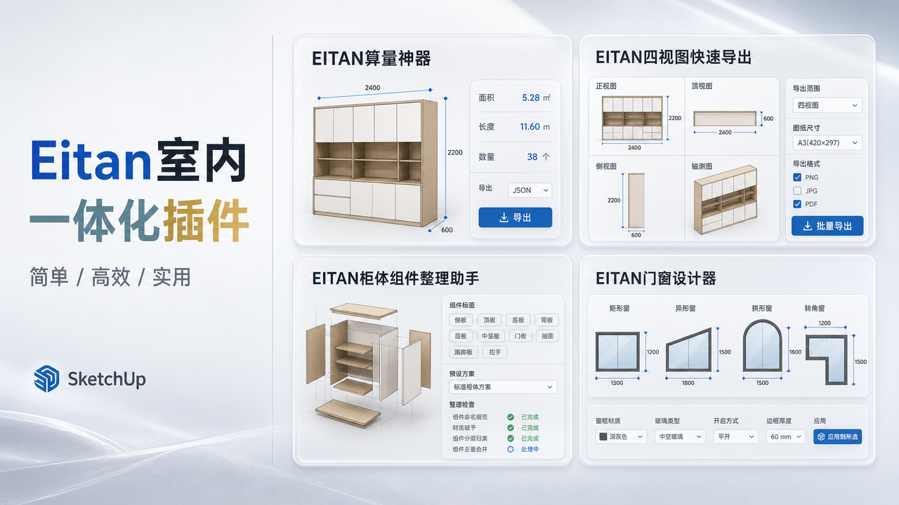
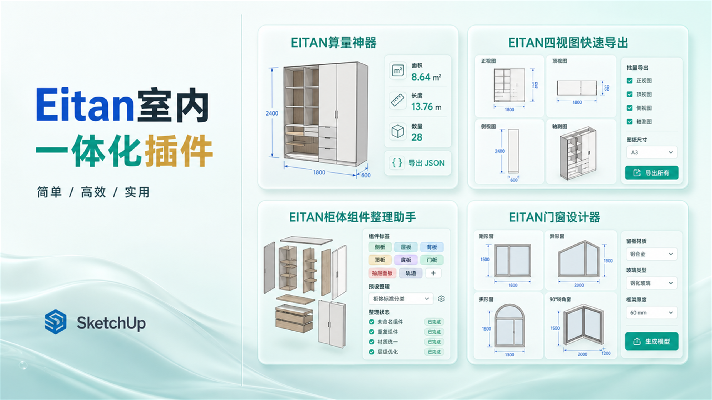

# fengmian-et

用于创建和修改 Eitan 系列软件封面：支持 `16:9`、`9:16`、`4:3`、`3:4`、`1:1` 五种比例和对应的 2K 输出。布局会按横向、竖向或方形方向自动切换，右侧或下方根据内容自动选择 `1x2`、`1x3`、`2x2` 或层级卡片布局。卡片可以使用 Apple UI 系统面板风格、毛玻璃风格，或两者的轻量混合风格。图标栏是可选的，只有用户提供或明确要求图标时才加入。

## 主要能力

- 支持以下比例和名义 2K 尺寸：`16:9`=`2560x1440`、`9:16`=`1440x2560`、`4:3`=`2048x1536`、`3:4`=`1536x2048`、`1:1`=`2048x2048`。
- 按平台、用户指定内容或随机请求选择比例；横向采用左标题/右内容，竖向采用上标题/下内容，方形在双栏和上下排版之间自动选择。
- 根据内容密度自动选择右侧卡片排版，不固定使用 `2x2`。
- 支持 Apple UI 风格：浅色半透明面板、细描边、克制圆角、轻阴影、清晰信息分组。
- 支持高级毛玻璃风格：亚克力材质、微弱折射、柔和边缘和底部雾化。
- 使用 `select_palette.py` 从 15 组受控浅色配色中随机选择背景，并保留随机种子；也可以按名称固定使用某一组。
- 用户要求时，可在左下角排列 GPT、Codex、Gemini 或其他身份图标；默认不主动添加图标。
- 新封面使用 Image2 生成，并在交付前检查尺寸、比例、标题、卡片和安全边距。

## 背景配色主题

Skill 内置 15 组低饱和背景主题。每组主题由背景底色、毛玻璃卡片色、主强调色和底部雾化色组成；随机选择只改变背景氛围，不改变标题、内容、卡片数量或排版结构。

| 名称 | 背景底色 | 毛玻璃色 | 强调色 | 视觉描述 |
| --- | --- | --- | --- | --- |
| `ice-lavender` | `#F0F0FF` | `#DCDFF0` | `#635BDB` | 冰雾淡紫，最接近原始参考风格 |
| `glacier-blue` | `#EEF7FF` | `#D8E9FF` | `#1677FF` | 冰川蓝，清透且有技术感 |
| `mint-glass` | `#EFFAF7` | `#D7F1EA` | `#0F9D8A` | 薄荷玻璃，清爽轻盈 |
| `mist-silver` | `#F4F5F7` | `#E1E4EA` | `#667085` | 雾银灰，克制的企业级质感 |
| `violet-gray` | `#F5F2FA` | `#E7DFFF` | `#7657D9` | 柔和灰紫，比参考色更突出 |
| `aqua-frost` | `#F0FBFF` | `#D8F1F6` | `#148EA8` | 水蓝冰霜，冷静的技术蓝绿 |
| `sage-ice` | `#F2F9F5` | `#DCEEE4` | `#3F8A68` | 鼠尾草冰绿，自然安静 |
| `rose-mist` | `#FFF4F7` | `#F6E1E8` | `#BE5F7A` | 雾玫瑰，柔和的编辑感 |
| `periwinkle-air` | `#F3F5FF` | `#E0E6FA` | `#536FC7` | 空气蓝紫，轻盈而精确 |
| `lemon-ice` | `#FFFCF1` | `#F3EFCF` | `#9A852D` | 冰柠檬金，明亮但不过饱和 |
| `teal-porcelain` | `#F0FAFA` | `#D8EEEE` | `#2F8F91` | 青瓷蓝绿，干净平衡 |
| `eucalyptus-cloud` | `#F3F9F1` | `#DCEBD7` | `#5C8D63` | 桉叶云绿，柔和沉静 |
| `coral-veil` | `#FFF6F3` | `#F5E2DA` | `#C46F5B` | 珊瑚薄纱，受控的暖色变化 |
| `cornflower-mist` | `#F1F6FF` | `#DCE7F7` | `#4C78B8` | 矢车菊雾蓝，实用清晰 |
| `pistachio-haze` | `#F7FBEF` | `#E8F0D0` | `#7C963C` | 开心果雾绿，柔和的橄榄强调 |

底部雾化色、渐变方向、光晕位置和毛玻璃强度会随每次随机选择继续生成。完整色值和规则见 [`references/cover-spec.md`](references/cover-spec.md)。

随机选择一组：

```powershell
python .\scripts\select_palette.py --mode random
```

固定指定一组：

```powershell
python .\scripts\select_palette.py --palette glacier-blue
```

固定配色并让气氛参数可复现：

```powershell
python .\scripts\select_palette.py --palette aqua-frost --seed cover-demo-01
```

## 目录结构

```text
fengmian-et/
|-- SKILL.md
|-- README.md
|-- .gitignore
|-- agents/
|   `-- openai.yaml
|-- references/
|   `-- cover-spec.md
|-- scripts/
|   |-- select_palette.py
|   |-- select_aspect.py
|   `-- update_cover.py       # 旧模板兼容脚本，新封面不使用
`-- assets/                   # 仅放有权公开和复用的素材
```

## 依赖说明

1. Codex 桌面应用或 CLI，并且已经登录可以正常使用。
2. `image2-generate` 能力。这个 skill 通过它调用 Image2；Image2 的凭据不属于本仓库，也不能上传到 GitHub。
3. Python 3.10 或更高版本，用于运行 `scripts/select_palette.py` 和 `scripts/select_aspect.py`。这两个脚本只使用 Python 标准库。
4. Pillow 只在你明确使用旧版 `scripts/update_cover.py` 时需要，新版 Image2 生成流程不需要它。

## 新电脑安装（Windows）

### 1. 安装基础软件

- 安装 Git：<https://git-scm.com/download/win>
- 安装 Codex 桌面应用，或安装你使用的 Codex CLI，并完成登录。
- 安装 Python 3.10+：<https://www.python.org/downloads/windows/>

安装 Git 和 Python 时，确保它们已加入系统 PATH。重新打开 PowerShell 后检查：

```powershell
git --version
python --version
```

### 2. 把 skill 克隆到 Codex skills 目录

默认目录是 `%USERPROFILE%\\.codex\\skills`。如果你设置了 `CODEX_HOME`，则使用 `%CODEX_HOME%\\skills`。

```powershell
$codexHome = if ($env:CODEX_HOME) { $env:CODEX_HOME } else { Join-Path $env:USERPROFILE '.codex' }
$skillRoot = Join-Path $codexHome 'skills'
$skillPath = Join-Path $skillRoot 'fengmian-et'

New-Item -ItemType Directory -Force -Path $skillRoot | Out-Null
git clone 'https://github.com/<你的GitHub用户名>/fengmian-et.git' $skillPath
```

如果目录已经存在，不要重复 `clone`，直接更新：

```powershell
Set-Location $skillPath
git pull --ff-only origin main
```

### 3. 检查 skill 是否完整

```powershell
Get-Content (Join-Path $skillPath 'SKILL.md') -TotalCount 12
python (Join-Path $skillPath 'scripts/select_palette.py') --mode random
python (Join-Path $skillPath 'scripts/select_palette.py') --palette glacier-blue
python (Join-Path $skillPath 'scripts/select_aspect.py') --mode random
```

然后重新启动 Codex，或者开启一个新任务，让它重新发现 skills。调用示例：

```text
$fengmian-et 标题为“Eitan室内一体化插件”，比例随机选择，按内容自动决定横向或竖向构图和卡片排版，使用 Apple UI 卡片风格，背景随机，使用 Image2 生成 2K 封面。
```

### 4. 检查 Image2 能力

`fengmian-et` 不包含 Image2 凭据，也不应该把凭据复制到新电脑的仓库中。新电脑需要使用已启用 Image2 的 Codex 环境，并确保 `image2-generate` skill 可用。如果 Codex 环境没有这个系统 skill，先更新 Codex 或联系当前环境管理员启用 Image2，再使用本 skill。

不要把以下内容上传到 GitHub：`.image2_api_key`、API key、个人 `config.toml`、`image2-settings.json`、生成图片和本地日志。

## 第一次上传到 GitHub

### 1. 创建仓库

在 GitHub 新建仓库，例如 `fengmian-et`。如果要公开给其他人使用，选择 `Public`。创建时可以不勾选 GitHub 的 README、`.gitignore` 和 License，避免与本地文件冲突；本仓库已经提供 README 和 `.gitignore`。

### 2. 初始化并推送

在当前电脑的 PowerShell 执行：

```powershell
$skillPath = 'C:\Users\EGD\.codex\skills\fengmian-et'
Set-Location $skillPath

git init
git branch -M main
git add SKILL.md README.md .gitignore agents references scripts
git status --short
git commit -m 'Initial release of fengmian-et'
git remote add origin 'https://github.com/<你的GitHub用户名>/fengmian-et.git'
git push -u origin main
```

确认 `assets/` 中的某个素材拥有公开和再分发权后，再单独添加它，例如：

```powershell
git add 'assets/your-approved-file.png'
```

如果已经配置过 `origin`，使用下面的命令替代 `git remote add origin`：

```powershell
git remote set-url origin 'https://github.com/<你的GitHub用户名>/fengmian-et.git'
```

### 3. 公开前检查素材版权

当前 skill 目录里的 `assets/` 可能包含参考封面或第三方软件图标。公开仓库前逐个确认你有权再分发它们；不确定来源的参考图、官方 Logo 或截图应删除、替换为自有素材，或只在本地保存而不提交。skill 的规则本身可以公开，素材的版权需要单独确认。

### 4. 添加开源许可证

仅把仓库设置为 Public 不等于自动授予他人使用权。建议在 GitHub 的 **Add file → Create new file** 中添加许可证：

- 想让别人最方便地使用、修改和再发布：通常选择 MIT License。
- 需要保留衍生作品的开源义务：考虑 GPL-3.0。
- 只允许查看、不允许自由再发布：不要把它称为开源，应使用明确的自定义许可。

如果选择 MIT，请把 GitHub 生成的 `LICENSE` 文件一并提交，并确认版权人和年份信息正确。没有得到明确许可前，不要把第三方 Logo 或参考图写进你的许可证范围。

## 后续更新流程

在开发电脑修改 skill 后：

```powershell
$skillPath = 'C:\Users\EGD\.codex\skills\fengmian-et'
Set-Location $skillPath

python 'C:\Users\EGD\.codex\skills\.system\skill-creator\scripts\quick_validate.py' $skillPath
git diff --check
git status --short
git add SKILL.md README.md .gitignore agents references scripts
git commit -m 'Improve adaptive cover layout rules'
git push origin main
```

如果这次确实更新了已确认可公开的素材，再单独执行 `git add 'assets/your-approved-file.png'`，并替换成真实文件名。

其他电脑同步更新：

```powershell
$codexHome = if ($env:CODEX_HOME) { $env:CODEX_HOME } else { Join-Path $env:USERPROFILE '.codex' }
$skillPath = Join-Path $codexHome 'skills\\fengmian-et'
Set-Location $skillPath
git pull --ff-only origin main
```

更新后重新启动 Codex 或新开一个任务即可。不要在多台电脑上直接修改同一个未提交版本；如果确实需要本地修改，先提交到自己的分支，再合并到 `main`。

## 建议的版本发布方式

当规则稳定后打一个版本标签，方便别人固定使用某个版本：

```powershell
git tag -a v1.0.0 -m 'First public release'
git push origin v1.0.0
```

以后有不兼容的规则变化时升级到 `v2.0.0`；只修正文案或小问题时可以使用 `v1.0.1`。README 中应记录每个版本新增的布局规则、配色规则和依赖变化。

## 常见问题

### Codex 找不到 skill

确认 `SKILL.md` 的真实路径是：

```text
%CODEX_HOME%\\skills\\fengmian-et\\SKILL.md
```

如果没有设置 `CODEX_HOME`，则应位于：

```text
%USERPROFILE%\\.codex\\skills\\fengmian-et\\SKILL.md
```

确认文件夹名称是 `fengmian-et`，不是仓库下载后的 `fengmian-et-main`。修正后重启 Codex 或新开任务。

### 随机配色脚本无法运行

确认 Python 版本至少为 3.10，并在 skill 目录运行：

```powershell
python .\\scripts\\select_palette.py --mode random
```

### 生成封面时 Image2 不可用

这不是布局规则问题，而是当前 Codex 环境没有可用的 `image2-generate` 能力、账户权限或 Image2 配置。不要把 API key 写入仓库，也不要用其他人的凭据替换它；先修复当前 Codex 的 Image2 能力，再重新生成。


## 生成示例

### Apple UI 四卡布局



### 冰川蓝毛玻璃布局



### Eitan 室内一体化插件

#### 雾银编辑网格



#### 薄荷玻璃编辑网格


